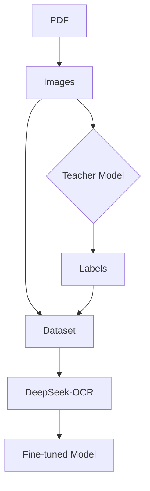

# DeepSeek-OCR Finetuning Toolkit

<div align="center">


**Finetune DeepSeek-OCR easily**<br/>
DeepSeek-OCR 모델을 위한 프로페셔널 파인튜닝 및 추론 도구

[](https://www.python.org/)
[](LICENSE)
[](https://github.com/astral-sh/uv)
[](https://huggingface.co/docs/transformers)
[](https://github.com/unslothai/unsloth)

[English Documentation](README.eng.md)

</div>

---

## Introduction

DeepSeek-OCR 파인튜닝 툴킷은 Unsloth의 가이드를 기반으로 설계되었습니다. 외부 Teacher 모델을 활용한 Pseudo Labeling부터 학습 데이터 생성, 모델 파인튜닝까지의 전 과정을 효율적으로 수행할 수 있도록 지원합니다.


### 파이프라인 워크플로우



**단계별 요약:**
1. **pdf2img**: PDF → 이미지 변환
2. **infer (Teacher)**: 외부 모델로 이미지 추론 → 라벨(Markdown) 생성
3. **데이터셋 구성**: 이미지 + 라벨 → JSONL 형식
4. **train (Student)**: DeepSeek-OCR LoRA 파인튜닝


<div align="center">

<a href="https://docs.unsloth.ai/models/deepseek-ocr-how-to-run-and-fine-tune"></a>

<a href="https://colab.research.google.com/github/unslothai/notebooks/blob/main/nb/Deepseek_OCR_(3B).ipynb#scrollTo=6bZsfBuZDeCL"></a>

</div>

---

## 주요 기능

### 완전한 워크플로우 지원
* **PDF 직접 입력**: 수동 이미지 변환 없이 PDF 파일에서 바로 추론 (`--pdf` 옵션)
* **스트리밍 마크다운 출력**: 문서별로 실시간 결과 저장, 추론 중에도 완료된 문서 확인 가능
* **자동 모델 다운로드**: Hugging Face에서 DeepSeek-OCR 자동 다운로드 (첫 실행 시)

### 효율적인 파인튜닝
* **LoRA 선택적 학습**: Vision Encoder, LLM, 또는 전체 모델을 선택적으로 파인튜닝
* **Unsloth 최적화**: 메모리 효율적인 학습 (Gradient Checkpointing, 4bit 양자화 지원)
* **유연한 이미지 처리**: Gundam 모드 (1024→640 crop) 등 다양한 해상도 프리셋

### API 및 로컬 모델 지원
* **OpenAI 호환 API**: vLLM, OpenAI API 등으로 Teacher 모델 추론
* **로컬 모델**: 로컬 GPU에서 직접 추론 (API 불필요)

---

## Quick Start

### Requirements

### Installation

```bash
# 저장소 클론
git clone https://github.com/your-username/ocr_finetune.git
cd ocr_finetune

# 가상환경 생성 및 활성화
uv venv
source .venv/bin/activate

# 의존성 설치 (uv 권장)
uv sync
```
---

## Usage

### 1. pdf2img: PDF를 이미지로 변환

```bash
uv run main.py pdf2img -s document.pdf -o ./images -d 200
```

| 옵션 | 단축 | 설명 | 기본값 |
|:---:|:---:|:---:|:---:|
| `--source` | `-s` | PDF 파일 또는 디렉토리 | (필수) |
| `--output` | `-o` | 출력 디렉토리 | `./output_images` |
| `--dpi` | `-d` | 이미지 해상도 | `200` |
| `--format` | `-f` | 이미지 포맷 (png, jpg) | `png` |
| `--start-page` | - | 시작 페이지 번호 | `1` |
| `--end-page` | - | 종료 페이지 번호 | (전체) |

### 2. inference

Teacher 모델로 학습 데이터를 생성하거나, 학습된 모델의 성능을 테스트합니다.

```bash
# PDF에서 직접 추론 (권장)
uv run main.py infer -p document.pdf -c config/api_model.yaml -t document

# 이미지에서 추론
uv run main.py infer -i ./images -c config/api_model.yaml -t ocr

# 체크포인트 모드로 추론 (중단 시 재개 가능)
uv run main.py infer -i ./images -c config/api_model.yaml -t document -r

# 체크포인트에서 재개 (인자 자동 로드)
uv run main.py infer -r ./data/result.checkpoint.json

# 사용 가능한 태스크 목록 보기
uv run main.py infer -c config/teacher_api.yaml -l
```

| 옵션 | 단축 | 설명 | 기본값 |
|:---:|:---:|:---:|:---:|
| `--img` | `-i` | 이미지 파일 또는 디렉토리 | - |
| `--pdf` | `-p` | PDF 파일 또는 디렉토리 | - |
| `--dpi` | `-d` | PDF 변환 시 해상도 | `200` |
| `--config` | `-c` | Teacher 모델 설정 YAML | (필수) |
| `--task` | `-t` | 태스크 이름 (prompts.yaml의 키) | `document` |
| `--output` | `-o` | 출력 경로 | (자동) |
| `--resume` | `-r` | 체크포인트 모드/재개 | - |
| `--list-prompts` | `-l` | 사용 가능한 태스크 목록 보기 | - |

> **체크포인트 재개**: `--resume`만 사용하면 체크포인트 모드 활성화, 파일 경로를 지정하면 해당 체크포인트에서 재개하며 인자들이 자동으로 로드됩니다.

<details>
<summary><strong>출력 형식 자세히 보기</strong></summary>

#### JSONL 형식 (학습용)
각 줄이 하나의 JSON 객체 (대용량 데이터셋에 적합):

```json
{"messages": [{"role": "<|User|>", "content": "<image>\n문서를 마크다운으로 변환하세요.", "images": ["page1.png"]}, {"role": "<|Assistant|>", "content": "# 제목\n\n내용..."}]}
```

#### Markdown 형식 (문서 검토용)
- `{name}_p{page}.png` 패턴의 이미지는 자동으로 `{name}.md`로 병합
- 각 문서 추론 완료 시 즉시 파일 저장 (스트리밍)
- 추론 중에도 완료된 문서 결과 확인 가능

**예시**:
```
images/
  report_p1.png  →  output/report.md
  report_p2.png  ↗
  invoice_p1.png →  output/invoice.md
```

</details>

### 3. 모델 파인튜닝

```bash
# Vision Encoder만 파인튜닝 (이미지 특징 추출 개선)
uv run main.py train -d data.jsonl -m vision

# LLM만 파인튜닝 (텍스트 생성 개선)
uv run main.py train -d data.jsonl -m llm

# 전체 모델 파인튜닝
uv run main.py train -d data.jsonl -m both

# 체크포인트에서 재개 (인자 자동 로드)
uv run main.py train -r ./output/checkpoints/checkpoint-100
```

| 옵션 | 단축 | 설명 | 기본값 |
|:---:|:---:|:---:|:---:|
| `--dataset` | `-d` | 학습 데이터셋 (JSONL) | (필수) |
| `--eval-dataset` | `-e` | 평가 데이터셋 | - |
| `--mode` | `-m` | 학습 레이어: `vision`, `llm`, `both` | `vision` |
| `--config` | `-c` | 학습 설정 YAML | `config/train_config.yaml` |
| `--output` | `-o` | 출력 디렉토리 | `./models/finetuned` |
| `--resume` | `-r` | 체크포인트에서 재개 | - |
| `--save-merged` | - | 병합된 모델 저장 | `false` |

> **체크포인트 재개**: `--resume`으로 체크포인트 경로를 지정하면 dataset, config, mode 등이 메타데이터에서 자동으로 로드됩니다.

<details>
<summary><strong>학습 모드 선택 가이드</strong></summary>

| 모드 | 적용 대상 | 사용 사례 |
|:---:|:---:|:---:|
| **vision** | Vision Encoder (qkv_proj, fc1, fc2 등) | 새로운 문서 레이아웃, 손글씨 인식 개선 |
| **llm** | Language Model (q_proj, gate_proj 등) | 도메인별 용어, 출력 형식 개선 |
| **both** | 전체 모델 | 완전히 새로운 도메인, 최대 성능 필요 시 |

**권장**: 대부분의 경우 `vision` 모드로 시작하세요. LLM은 이미 범용적인 언어 능력을 가지고 있습니다.

</details>

### 4. 모델 평가

```bash
uv run main.py evaluate -d eval.jsonl -t document -o results.json
```

| 옵션 | 단축 | 설명 | 기본값 |
|:---:|:---:|:---:|:---:|
| `--dataset` | `-d` | 평가 데이터셋 | (필수) |
| `--train-config` | `-c` | 학습 설정 YAML | `config/train_config.yaml` |
| `--task` | `-t` | 태스크 이름 | `document` |
| `--output` | `-o` | 결과 출력 경로 (JSON, CSV) | - |

---

## How to edit config files

추론 설정 파일의 핵심 옵션들을 설명합니다.

### `type`: 추론 방식 선택

| 값 | 설명 | 사용 시점 |
|:---:|:---|:---|
| `api` | OpenAI 호환 API 서버 사용 | vLLM, TGI 등 외부 서버 운영 시 |
| `local` | 로컬 GPU에서 직접 추론 | 단일 머신, API 서버 없이 사용 시 |

```yaml
# API 모드 - 외부 서버 호출
type: "api"
api:
  base_url: "http://localhost:8000/v1"
  model_name: "deepseek-ocr"
  api_key: "your-api-key"

# Local 모드 - 로컬 GPU 사용
type: "local"
local:
  model_path: "models/deepseek_ocr"
  load_in_4bit: false
```

### `model_type`: 출력 후처리 방식

모델 출력에서 특수 태그를 제거하는 전처리기를 선택합니다.
(마크다운으로 결과를 보기 편리하게 함)

| 값 | 설명 | 제거하는 태그 |
|:---:|:---|:---|
| `default` | 후처리 없음 | 없음 (원본 그대로) |
| `deepseek-ocr` | OCR 태스크용 | `<\|...\|>` 특수 태그 |
| `deepseek-document` | 문서 파싱용 | `<\|ref\|>`, `<\|det\|>`, 좌표 정보 등 |

```yaml
# 문서 파싱 시 (좌표 태그 제거)
model_type: "deepseek-document"

# 단순 OCR 시
model_type: "deepseek-ocr"

# 후처리 없이 원본 출력
model_type: "default"
```

<details>
<summary><strong>DeepSeek 출력 예시 (전처리 전/후)</strong></summary>

**전처리 전** (`deepseek-document` 원본 출력):
```
<|ref|>text<|/ref|><|det|>[[238, 260, 480, 275]]<|/det|>
'실시간 대중교통 혼잡도 예측 서비스' 개발

<|ref|>sub_title<|/ref|><|det|>[[47, 315, 152, 333]]<|/det|>
## 자기소개서
```

**전처리 후** (`model_type: "deepseek-document"`):
```
'실시간 대중교통 혼잡도 예측 서비스' 개발

## 자기소개서
```

</details>

### `--task`: 프롬프트 선택

`prompts` 섹션에 정의된 키를 선택합니다. 각 태스크는 `system`과 `user` 프롬프트를 가집니다.

> **⚠️ 주의**: `ocr`, `document` 등 기본 태스크는 **DeepSeek-OCR 모델이 학습된 프롬프트**입니다.
> 이 프롬프트들을 수정하면 모델 성능이 저하될 수 있습니다.
> 새로운 태스크가 필요하면 기존 프롬프트를 수정하지 말고 **새 키를 추가**하세요.

```yaml
# config/teacher_api.yaml
prompts:
  # ⚠️ 기본 태스크 - 수정하지 마세요
  ocr:                    # --task ocr (DeepSeek-OCR 기본)
    system: "You are an OCR assistant..."
    user: "Extract all text from this image."

  document:               # --task document (DeepSeek-OCR 기본)
    system: "You are a document parsing assistant..."
    user: "Convert this document to Markdown format."

  # ✅ 커스텀 태스크 - 자유롭게 추가하세요
  invoice:                # --task invoice (사용자 정의)
    system: "You are an invoice parser..."
    user: "Extract invoice details as JSON."

  medical_report:         # --task medical_report (사용자 정의)
    system: "You are a medical document parser..."
    user: "Extract patient information and diagnosis."
```

```bash
# 사용 예시
uv run main.py infer -p invoice.pdf -c config/teacher_api.yaml -t invoice
```

### `output.format`: 출력 형식

| 값 | 설명 | 파일 형태 |
|:---:|:---|:---|
| `jsonl` | 학습용 데이터셋 | 한 줄에 하나의 JSON |
| `json` | JSON 배열 | 전체를 하나의 JSON 배열로 |
| `md` | 마크다운 파일 | 문서별로 `.md` 파일 생성 |

```yaml
output:
  format: "md"        # 마크다운 파일로 저장
  save_images: false  # 이미지 함께 저장 여부
```

**마크다운 출력 시 자동 병합**: `{name}_p{page}.png` 패턴의 이미지는 `{name}.md`로 자동 병합됩니다.

---

## 설정 파일

설정 예제는 `config/examples/` 디렉토리에서 확인할 수 있습니다.

### 학습 설정 (`train_config.yaml`)

```yaml
# 모델 설정
model:
  base_model_path: "models/deepseek_ocr"
  load_in_4bit: false
  use_gradient_checkpointing: "unsloth"

# LoRA 설정
lora:
  r: 16
  lora_alpha: 16
  lora_dropout: 0

  # --mode vision 시 적용
  vision_target_modules:
    - "qkv_proj"
    - "out_proj"
    - "fc1"
    - "fc2"

  # --mode llm 시 적용
  llm_target_modules:
    - "q_proj"
    - "k_proj"
    - "v_proj"
    - "o_proj"
    - "gate_proj"
    - "up_proj"
    - "down_proj"

# 학습 하이퍼파라미터
training:
  per_device_train_batch_size: 2
  gradient_accumulation_steps: 4
  learning_rate: 2.0e-4
  max_steps: 100
  logging_steps: 1
  save_steps: 50

# 이미지 처리 (Gundam 모드 권장)
image:
  image_size: 640
  base_size: 1024
  crop_mode: true
```

<details>
<summary><strong>이미지 크기 프리셋 보기</strong></summary>

| 프리셋 | base_size | image_size | crop_mode | 용도 |
|:---:|:---:|:---:|:---:|:---:|
| Tiny | 512 | 512 | false | 빠른 실험, 저메모리 |
| Small | 640 | 640 | false | 일반 문서 |
| Base | 1024 | 1024 | false | 고해상도 문서 |
| **Gundam** | **1024** | **640** | **true** | **권장 (성능/속도 균형)** |
| Large | 1280 | 1280 | false | 최고 품질 |

</details>

### Teacher 모델 설정 (`teacher_api.yaml`)

```yaml
type: "api"  # api 또는 local
model_type: "default"

# API 설정
api:
  base_url: "http://localhost:8000/v1"
  model_name: "deepseek-ocr"
  api_key: "your-api-key"

# 생성 파라미터
generation:
  temperature: 0.1
  max_tokens: 4096

# 요청 설정
request:
  timeout: 120
  max_retries: 3
  concurrent_requests: 4

# 프롬프트 정의
prompts:
  document:
    system: |
      You are a document parsing assistant.
      Convert the document image to structured Markdown.
    user: |
      Convert this document to Markdown format.

# 출력 설정
output:
  format: "md"  # jsonl, json, md
  save_images: false
```

---

## 데이터셋 형식

학습 데이터셋은 JSONL 형식을 사용합니다:

```json
{
  "messages": [
    {
      "role": "<|User|>",
      "content": "<image>\nConvert this document to Markdown.",
      "images": ["path/to/image.png"]
    },
    {
      "role": "<|Assistant|>",
      "content": "# Document Title\n\n## Section 1\n\nContent here..."
    }
  ]
}
```

**주의사항**:
- `images` 필드는 이미지 파일 경로 배열입니다
- `content`에 `<image>` 토큰이 반드시 포함되어야 합니다
- 각 줄은 독립적인 JSON 객체입니다 (JSON 배열 아님)

---

## 자동 모델 다운로드

`train`, `evaluate`, `inspect`, `infer` 명령 실행 시 `models/deepseek_ocr` 폴더가 없으면 Hugging Face에서 자동으로 다운로드됩니다.

```
Downloading unsloth/DeepSeek-OCR from Hugging Face...
✓ Model downloaded to models/deepseek_ocr
```

**수동 다운로드** (선택사항):
```bash
huggingface-cli download unsloth/DeepSeek-OCR --local-dir models/deepseek_ocr
```

## 트러블슈팅

<details>
<summary><strong>CUDA Out of Memory 오류</strong></summary>

```yaml
# train_config.yaml에서 배치 크기 줄이기
training:
  per_device_train_batch_size: 1
  gradient_accumulation_steps: 8

# 또는 4bit 양자화 사용
model:
  load_in_4bit: true
```

</details>

<details>
<summary><strong>모델 다운로드 실패</strong></summary>

```bash
# Hugging Face 토큰 설정 (private 모델의 경우)
export HF_TOKEN="your_huggingface_token"

# 또는 수동으로 다운로드
huggingface-cli login
huggingface-cli download unsloth/DeepSeek-OCR --local-dir models/deepseek_ocr
```

</details>

<details>
<summary><strong>API 연결 오류</strong></summary>

```bash
# 1. vLLM 서버가 실행 중인지 확인
curl http://localhost:8000/v1/models

# 2. config/teacher_api.yaml의 base_url 확인
# 3. 방화벽 설정 확인
```

</details>

---

## 라이선스

MIT License

---

<div align="center">

**더 나은 OCR을 위해**

[이슈 제기](https://github.com/your-username/ocr_finetune/issues) • [기여하기](https://github.com/your-username/ocr_finetune/pulls) • [문서](https://github.com/your-username/ocr_finetune/wiki)

Made with ❤️ by OCR Finetune Contributors

</div>
